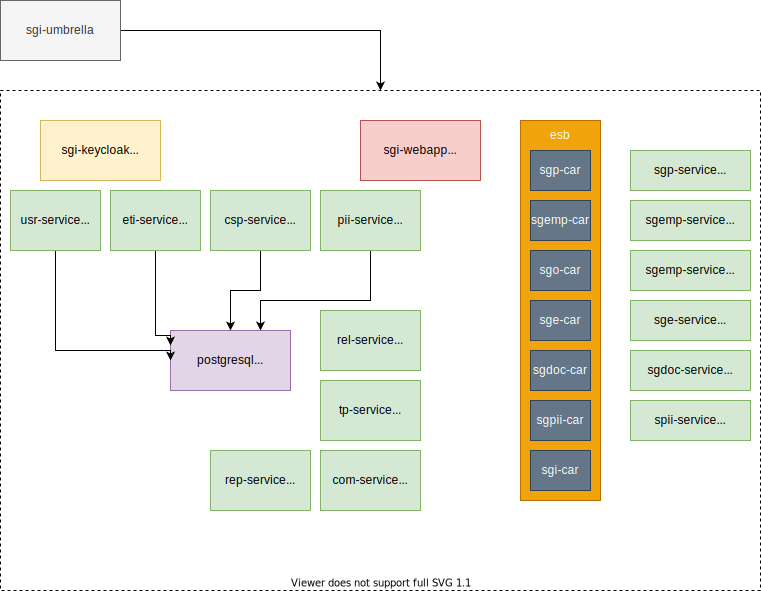

# SGI Helm Charts

This repository includes the deployment charts for the SGI application, that is composed of several micro-services.

## Structure



## Deployment

These charts can be used to carry out the deployments with a given environment configuration.

## Step by step installation guide

Configure and update the available charts from this repo.

```bash
# add external repository
helm repo add bitnami https://charts.bitnami.com/bitnami
# add this repository
helm repo add sgi-helm https://hercules-sgi.github.io/sgi-helm
# update repository information
helm repo update
```

Create namespace (for example sgi-demo)

```bash
kubectl create namespace sgi-demo
```

Install the chart (see: [values.demo.yaml](https://github.com/hercules-sgi/sgi-helm/blob/main/config/values.demo.yaml))

```bash
helm upgrade sgi sgi-helm/sgi-umbrella --timeout 10m0s --wait --wait-for-jobs --install --namespace sgi-demo -f ./config/values.demo.yaml
```

Optional - Configure the configmap for Keycloak realm (see: [sgi-realm.json](https://github.com/hercules-sgi/sgi-helm/blob/main/charts/sgi-keycloak/config/sgi-realm.json))

```bash
kubectl delete configmap -n sgi-demo sgi-sgi-keycloak
kubectl create configmap -n sgi-demo sgi-sgi-keycloak --from-file=sgi-realm.json=./charts/sgi-keycloak/config/sgi-realm.json
kubectl rollout restart deployment -n sgi-demo sgi-sgi-keycloak
```

Optional - Unistall the chart

```bash
helm -n sgi-demo uninstall sgi
```